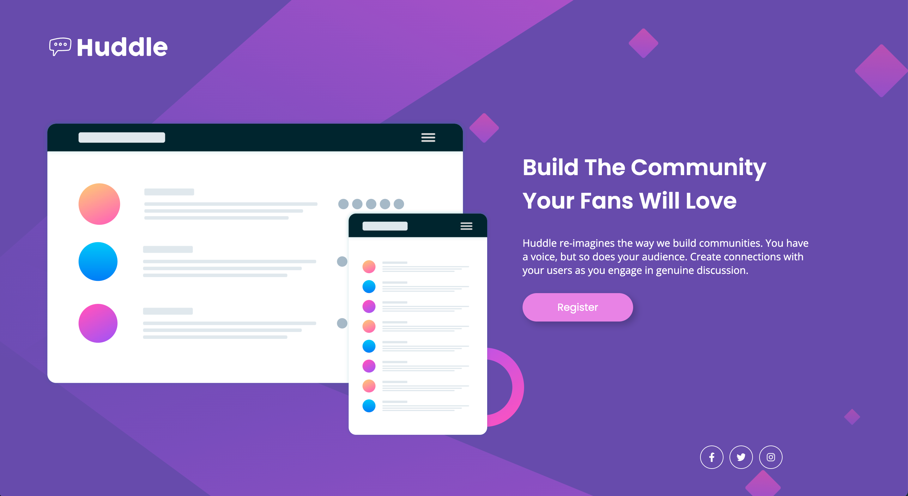
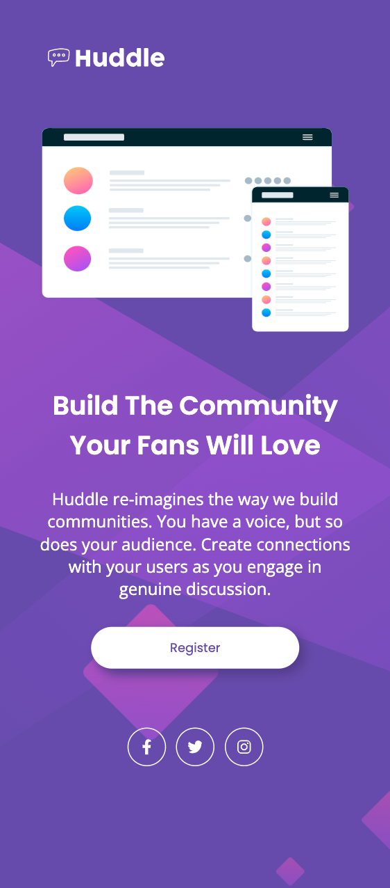

# Huddle Landing Page With Single Introductory Section Master
[README.md](https://github.com/omathestudio/huddle-landing-page-with-single-introductory-section-master/files/10924258/README.md)

# Frontend Mentor - Huddle landing page with single introductory section solution

This is a solution to the [Huddle landing page with single introductory section challenge on Frontend Mentor](https://www.frontendmentor.io/challenges/huddle-landing-page-with-a-single-introductory-section-B_2Wvxgi0).
Frontend Mentor challenges help you improve your coding skills by building realistic projects.

## Table of contents

- [The challenge](#the-challenge)
- [Screenshot](#screenshot)
- [Links](#links)
- [Built with](#built-with)
- [What I learned](#what-i-learned)
- [Continued development](#continued-development)
- [Useful resources](#useful-resources)
- [Author](#author)

### The challenge

Users should be able to:

- View the optimal layout for the page depending on their device's screen size
- See hover states for all interactive elements on the page

### Screenshot





### Links

- Live Site URL: [GitHub Pages](https://omathestudio.github.io/huddle-landing-page-with-single-introductory-section-master/)

### Built with

- Semantic HTML5 markup
- CSS custom properties
- Flexbox
- CSS Grid

### What I learned

In this challenge I learnt responsive design with the use of media queries, a tool that I have struggled with before.

Here are some code snippets on how I achieved this:

```html
<section>
  <p>
    Huddle re-imagines the way we build communities. You have a voice, but so
    does your audience. Create connections with your users as you engage in
    genuine discussion.
  </p>
</section>
```

```css
@media screen and (max-width: 375px) {
  section {
    display: flex;
    flex-direction: column;
    align-items: center;
    justify-content: center;
    text-align: center;
    width: 100%;
  }
}
```

### Continued development

To continue developing my HTML and CSS skills, I would like to thoroughly learn responsive design and media queries.

### Useful resources

- [MDN](https://developer.mozilla.org/en-US/) - This helped me to code the media queries for my responsive design. I really like this resource as it gives a visual image of what the code should look like.

## Author

- Frontend Mentor - [@omathestudio](https://www.frontendmentor.io/profile/omathestudio)
